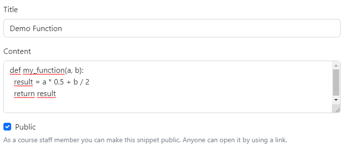
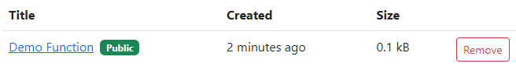

# Instructions for course staff members

## Creating public items

As a course staff member you can create public code snippets. Select New tab and
select the option Public below the text area. Anyone who has the link for this
item can access it.

The created content will have a reference to that course you have logged in most
recently.

Public items are shown with a green badge in the main page.

It is not possible to share public binary content. The content must be copied
and pasted in textual format.

## Opening shared content

After you have logged in to Code Vault, you are able to open the shared links
and see the content.

Code Vault will show the name of course and the owner of the content after
opening a link.

Only textual content can be shown in Code Vault. Binary files must be
downloaded. Please be careful with any binary content as they may contain
malicious content.

It might be handy to copy the contents to clipboard by clicking the
corresponding button and pasting the code to IDE analyze its behavior better.

## Working with multiple courses at the same time

If you are working as a course staff member in multiple courses at the same
time, you can log in to Code Vault via several course instances in the course
management systems. Code Vault remembers all the courses with the course staff
role and you can open shared content of any of these courses without a need to
log in and switching between the courses in Code Vault all the time.

This information is stored in the session which will expire after 30 days by
default. After the session has expired you need to login again to revalidate
your course staff member status.
