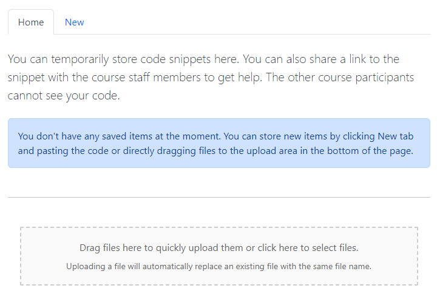
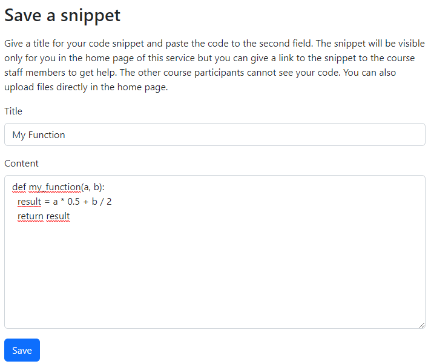
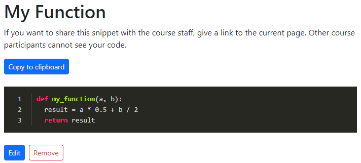
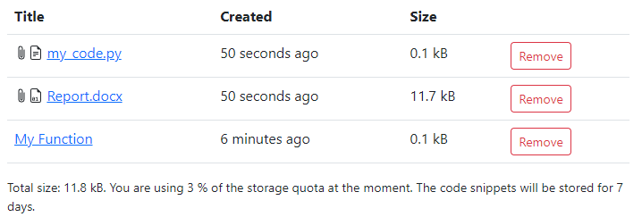

# Instructions for students

## Creating new items

There are two ways to store new items to Code vault. Both of these are available
in the main page after logging in.

### Copy & Paste

If you are working with IDE, it might be easy just to copy your code to
clipboard. Click then New tab, fill in a title for your code and paste your code
to the text area. Then click Save and your code will be saved to Code Vault.

After saving a new page will open showing your code with syntax highlighting.
The page gives the option to edit the code if needed. When editing code, the
original sharing link will remain the same and course staff members can access
also the updated content by using the same link.

### Drag & Drop

If you have multiple files or files are easily available, it is also possible
directly to drag and drop the files to the gray area in the bottom of the main
page. You can also click the area to select the files manually.

After the files are uploaded they are visible in the main page.

It is possible to upload both text and binary files but only text files can be
viewed in Code Vault. For binary files the only option is to download them. A
file is recognized as a text file if it is UTF-8 encoded.

:warning: Please notice that uploading a file with a same name that already
exists in Code Vault will overwrite the contents of the existing file.

## Managing Content

In the main page you can see all your content.

The uploaded files are indicated with the attachment icon. The icon will also
indicate the type of the file: a text or a binary file. If the uploaded file can
be recognized as UTF-8 encoded file, it will have the text file icon. Otherwise
it has the binary file icon.

The table will show the sizes of the files and has buttons to remove content.
Below the table you can see the total size of your files, the allowed total size
and how many days the files are stored in Code Vault.

## Sharing Content

If you want to share your code with the course staff members, you can either
copy the link in the main page or open the content and copy the link of that
page. Only the course staff members can open your link even if it is publicly
posted to a course forum etc.

Sharing is the only way others can access your content. If you don't share a
link, only you can see the files in Code Vault.
